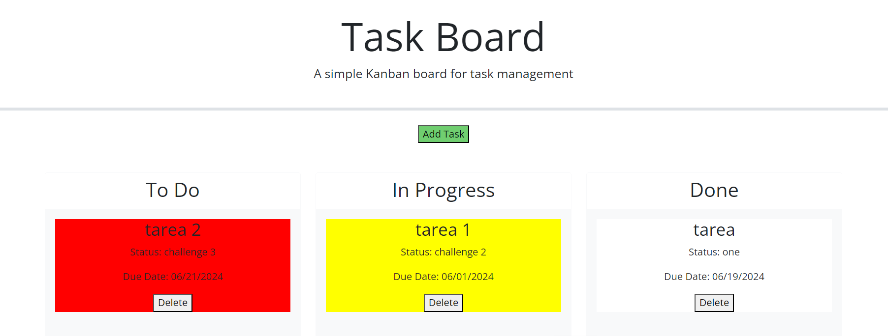

# Kanban-Board

## Description 
In this interactive website, users will be able 
to use my Kanban board for task management. When users press the Add Task button, then theyll be presented with a Modal form where theyll put their
tasks information. For this part of the project, 
I used my knowledge of JavaScript: I appplied addEventListeners, document.getElementById, and more. I also used datepicker from jquery UI and bootstrap. 

## Links 
Url to my deployed app:
https://gabrielasiu.github.io/Kanban-Board/

Url to my git repository:
https://github.com/Gabrielasiu/Kanban-Board 

